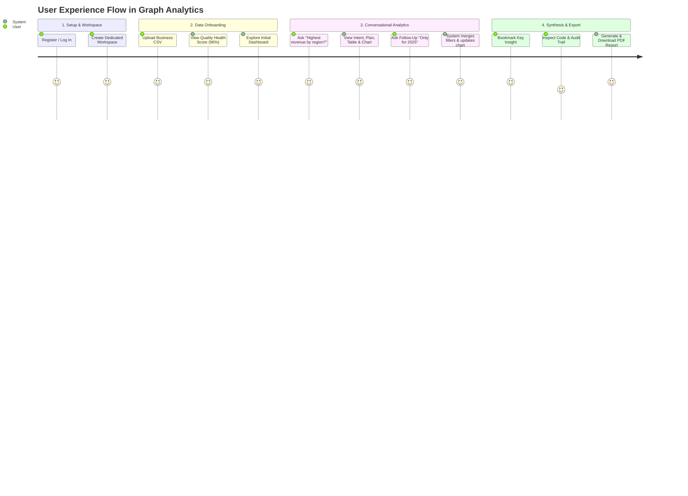
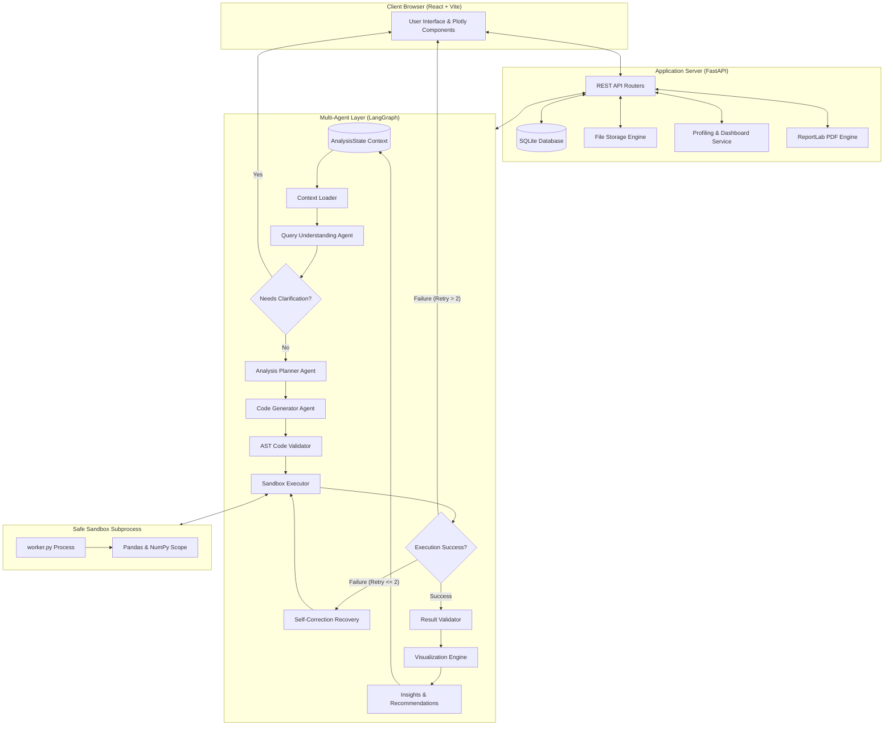
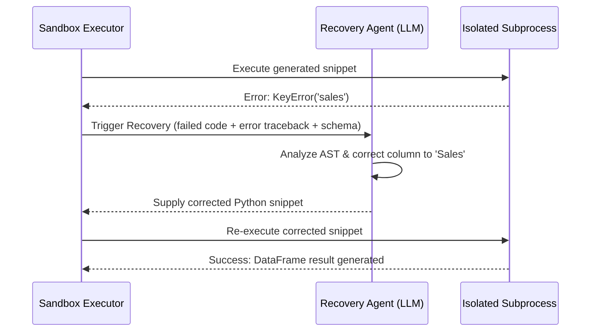
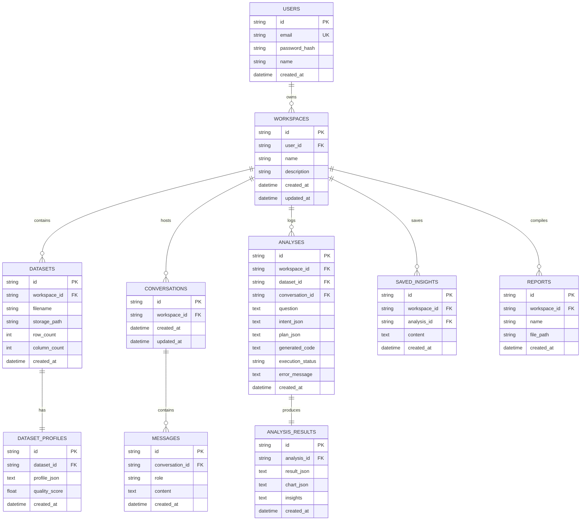

# Graph Analytics: Comprehensive Technical & Non-Technical Master Documentation

> **A Multi-Agent System for Stateful Data Analysis**  
> *Enterprise-grade Conversational Analytics, Automated Dataset Profiling, AST-Validated Sandbox Execution, and Executive PDF Intelligence Reporting.*

---

## 📑 Table of Contents

1. [Executive Summary & Non-Technical Overview](#1-executive-summary--non-technical-overview)
   - [1.1 Product Vision & Core Mission](#11-product-vision--core-mission)
   - [1.2 The Business Problem Statement](#12-the-business-problem-statement)
   - [1.3 Target Audience & User Personas](#13-target-audience--user-personas)
   - [1.4 Key Value Propositions & ROI](#14-key-value-propositions--roi)
   - [1.5 Competitive Differentiation Matrix](#15-competitive-differentiation-matrix)
2. [End-to-End User Experience & Functional Modules](#2-end-to-end-user-experience--functional-modules)
   - [2.1 User Journey Walkthrough](#21-user-journey-walkthrough)
   - [2.2 Workspace Management](#22-workspace-management)
   - [2.3 Dataset Intelligence & Quality Profiling](#23-dataset-intelligence--quality-profiling)
   - [2.4 Overview Analytical Dashboard](#24-overview-analytical-dashboard)
   - [2.5 Conversational AI Analyst](#25-conversational-ai-analyst)
   - [2.6 Explainability & Audit History](#26-explainability--audit-history)
   - [2.7 Saved Insights & Executive PDF Reports](#27-saved-insights--executive-pdf-reports)
3. [System Architecture & Design Patterns](#3-system-architecture--design-patterns)
   - [3.1 High-Level Architecture Diagram](#31-high-level-architecture-diagram)
   - [3.2 4-Tier Decoupled Layer Model](#32-4-tier-decoupled-layer-model)
   - [3.3 Technology Stack Inventory](#33-technology-stack-inventory)
4. [LangGraph Multi-Agent Orchestration Engine](#4-langgraph-multi-agent-orchestration-engine)
   - [4.1 Multi-Agent Workflow State Machine](#41-multi-agent-workflow-state-machine)
   - [4.2 AnalysisState Data Structure](#42-analysisstate-data-structure)
   - [4.3 Comprehensive Agent Node Breakdown](#43-comprehensive-agent-node-breakdown)
   - [4.4 State Transitions & Conditional Edge Logic](#44-state-transitions--conditional-edge-logic)
   - [4.5 Self-Correction & Error Recovery Loop](#45-self-correction--error-recovery-loop)
   - [4.6 Multi-Turn Stateful Conversational Memory](#46-multi-turn-stateful-conversational-memory)
5. [Security Architecture & Safe Subprocess Sandbox](#5-security-architecture--safe-subprocess-sandbox)
   - [5.1 Threat Model for AI-Generated Code Execution](#51-threat-model-for-ai-generated-code-execution)
   - [5.2 AST (Abstract Syntax Tree) Static Code Validator](#52-ast-abstract-syntax-tree-static-code-validator)
   - [5.3 Isolated Worker Subprocess Isolation (`worker.py`)](#53-isolated-worker-subprocess-isolation-workerpy)
   - [5.4 Execution Whitelist & Namespace Sanitation](#54-execution-whitelist--namespace-sanitation)
   - [5.5 Timeout & Resource Governance](#55-timeout--resource-governance)
6. [Dataset Profiling, Quality Engine & Dashboard Service](#6-dataset-profiling-quality-engine--dashboard-service)
   - [6.1 Statistical Metric Extraction](#61-statistical-metric-extraction)
   - [6.2 Automated Data Quality Health Scoring](#62-automated-data-quality-health-scoring)
   - [6.3 Business KPI Candidate Detection Heuristics](#63-business-kpi-candidate-detection-heuristics)
   - [6.4 Automatic Initial Dashboard Generation](#64-automatic-initial-dashboard-generation)
7. [Dynamic Visualization Engine & Plotly Rules](#7-dynamic-visualization-engine--plotly-rules)
   - [7.1 Intelligent Chart vs. Table Suppression Rules](#71-intelligent-chart-vs-table-suppression-rules)
   - [7.2 Multidimensional Plotly Dispatch Hierarchy](#72-multidimensional-plotly-dispatch-hierarchy)
   - [7.3 Interactive Client-Side Data Table](#73-interactive-client-side-data-table)
8. [Database Schema & Entity Relationship Model](#8-database-schema--entity-relationship-model)
   - [8.1 Relational Entity Relationship Diagram](#81-relational-entity-relationship-diagram)
   - [8.2 Detailed Table Specifications](#82-detailed-table-specifications)
9. [REST API Reference & Endpoints](#9-rest-api-reference--endpoints)
   - [9.1 Authentication & User Endpoints](#91-authentication--user-endpoints)
   - [9.2 Workspace Management Endpoints](#92-workspace-management-endpoints)
   - [9.3 Dataset & Profiling Endpoints](#93-dataset--profiling-endpoints)
   - [9.4 Analysis & Conversational Execution Endpoints](#94-analysis--conversational-execution-endpoints)
   - [9.5 Chat & Session History Endpoints](#95-chat--session-history-endpoints)
   - [9.6 Saved Insights & Report Endpoints](#96-saved-insights--report-endpoints)
10. [Frontend Component Architecture & UX Design](#10-frontend-component-architecture--ux-design)
    - [10.1 UI Component Tree](#101-ui-component-tree)
    - [10.2 State Management Flow](#102-state-management-flow)
    - [10.3 Styling, Theme & Design Tokens](#103-styling-theme--design-tokens)
11. [Installation, Configuration & Operational Guide](#11-installation-configuration--operational-guide)
    - [11.1 Prerequisites & System Requirements](#111-prerequisites--system-requirements)
    - [11.2 Environment Configuration](#112-environment-configuration)
    - [11.3 Backend Setup & Execution](#113-backend-setup--execution)
    - [11.4 Frontend Setup & Execution](#114-frontend-setup--execution)
12. [Quality Assurance, Testing & Validation](#12-quality-assurance-testing--validation)
    - [12.1 Test Suite Breakdown](#121-test-suite-breakdown)
    - [12.2 Verification of Bug Fixes & Edge Cases](#122-verification-of-bug-fixes--edge-cases)
13. [Future Roadmap & Extensibility](#13-future-roadmap--extensibility)

---

# 1. Executive Summary & Non-Technical Overview

### 1.1 Product Vision & Core Mission
**Graph Analytics** bridges the communication divide between raw business data and non-technical decision-makers. In modern enterprises, data is ubiquitous—stored in ERP systems, CRM platforms, and corporate spreadsheets. However, translating questions like *"Which product line had the steepest margin decline in Q3?"* into accurate business answers traditionally requires specialized data analytics personnel proficient in Python, SQL, Tableau, or Power BI.

Graph Analytics provides an **AI-driven conversational analytics partner**. Non-technical users interact using natural language, receiving:
- Exact quantitative calculations executed by verified code,
- Interactive Plotly visualizations,
- Data quality audits,
- Clear executive business insights,
- Exportable, audit-ready PDF executive reports.

---

### 1.2 The Business Problem Statement
When non-technical professionals attempt to use general-purpose generative AI tools (such as public ChatGPT, Claude, or Copilot interfaces) for quantitative business analytics, three critical failure modes occur:

```
┌────────────────────────────────────────────────────────────────────────┐
│                        THE PITFALLS OF GENERAL LLMs                    │
├───────────────────────┬──────────────────────┬─────────────────────────┤
│    1. Hallucination   │   2. Privacy Leaks   │   3. Stateless Amorphy  │
├───────────────────────┼──────────────────────┼─────────────────────────┤
│ LLMs are language     │ Sending sensitive    │ Standard chatbots       │
│ models, not calculat- │ corporate CSV data   │ treat each prompt in    │
│ ors. When asked to    │ into 3rd-party LLM   │ isolation, dropping     │
│ sum 5,000 rows, they  │ prompts exposes PII  │ filters, metrics, and   │
│ guess numbers rather  │ and breaches privacy │ context during follow-up│
│ than compute them.    │ regulations (GDPR).  │ questions.              │
└───────────────────────┴──────────────────────┴─────────────────────────┘
```

**Graph Analytics solves these challenges through architectural decoupling:**
1. **Zero Raw Data Exposure**: Raw CSV records are kept locally on the server; only column names, data types, and high-level statistical summaries are provided to the LLM.
2. **Deterministic Code Execution**: Calculations are executed with 100% mathematical precision using the Python Pandas engine in an isolated sandbox.
3. **Stateful Graph Orchestration**: LangGraph coordinates multiple specialized AI agents that maintain active filters, dimensions, and metrics across multi-turn dialogues.

---

### 1.3 Target Audience & User Personas

| Persona | Primary Goal | How Graph Analytics Delivers |
| :--- | :--- | :--- |
| **C-Suite Executives & VPs** | Rapid business performance visibility without waiting on BI backlogs. | Instant KPI summaries, high-level business findings, strategic recommendations, and 1-click downloadable Executive PDF reports. |
| **Product & Sales Managers** | Ad-hoc segmentation, regional performance queries, and trend identification. | Interactive Plotly bar and line charts, multi-turn follow-ups (*"Only for West region"*, *"Compare with 2024"*), and follow-up suggestion chips. |
| **Financial & Business Analysts** | Verifiable calculations, auditability, and data cleanliness assessments. | Automated data quality health score (0–100%), AST code inspection modal, full execution logs, and searchable data table with CSV/JSON/TSV export. |
| **Data Engineering Teams** | Safe self-service enablement without risk of server crashes or data corruption. | Defense-in-depth AST static code validator, subprocess isolation, restricted namespace, and strict 15-second execution timeouts. |

---

### 1.4 Key Value Propositions & ROI
- **Reduces Time-to-Insight from Days to Seconds**: Eliminates ticketing backlogs for standard exploratory data questions.
- **Eliminates Numerical Hallucination**: Every number displayed in the response is computed deterministically by Pandas.
- **Explainable by Design**: Every step is fully transparent—users can view the generated plan, review the exact Python code executed, inspect execution logs, and verify raw results.
- **Enterprise Self-Healing**: Includes an automated recovery agent that catches syntax and schema errors, repairs the code, and retries automatically without user intervention.

---

### 1.5 Competitive Differentiation Matrix

| Capability | Generic LLM Chatbots (ChatGPT / Claude) | Traditional BI Tools (Tableau / Power BI) | Graph Analytics Multi-Agent Platform |
| :--- | :---: | :---: | :---: |
| **Natural Language Querying** | Excellent | Limited / Add-on | **Native & Context-Aware** |
| **Calculation Accuracy** | Poor (Prone to Hallucination) | Exact (Formulas/DAX) | **Exact (Deterministic Pandas Engine)** |
| **Setup Complexity** | Zero | High (Data modeling, DAX) | **Zero (Automated Profiling & Dashboard)** |
| **Data Privacy & Governance** | Risky (Data sent to LLM) | Internal Server | **Strict (Data stays on local server)** |
| **Multi-Turn Contextual Follow-up** | Inconsistent | Manual filtering | **Stateful LangGraph Memory** |
| **Automated Data Quality Audit** | None | Manual | **Automated Health Score & Warnings** |
| **Self-Correction & Error Recovery** | None | None (Fails silently) | **Automated AST Self-Healing Loop** |
| **Exportable Executive PDF** | Text copy-paste | Complex Dashboard Export | **Automated ReportLab PDF Generator** |

---

# 2. End-to-End User Experience & Functional Modules



### 2.1 User Journey Walkthrough
1. **Authentication**: Users access the platform via a secure, token-authenticated interface (JWT).
2. **Workspace Creation**: Workspaces isolate datasets, analysis sessions, conversations, saved insights, and reports by domain or department (e.g., *"Retail Sales Analysis"*, *"Q3 Financial Audit"*).
3. **Dataset Ingestion**: The user uploads any standard CSV file. The backend immediately analyzes and profiles the data without requiring manual schema mapping.
4. **Instant Analytical Orientation**: The system presents an **Overview Dashboard** displaying automated KPI cards, a monthly trend line chart, top category distributions, and suggested questions.
5. **Interactive Conversational Analysis**: The user asks questions in plain English. The multi-agent state machine interprets intent, produces a logical plan, executes validated Pandas code, renders an interactive Plotly chart, and writes a business summary with recommendations.
6. **Multi-Turn Exploration**: The user refines results with follow-ups like *"Only for Corporate clients"* or clicks suggested chips.
7. **Report Compilation**: The user bookmarks insights, navigates to the **Reports & Insights** module, enters an executive title, and generates a formatted, downloadable PDF document.

---

### 2.2 Workspace Management
- **Role**: Organizational boundaries separating projects and operational contexts.
- **Features**:
  - Multi-workspace switching via header dropdown.
  - Independent dataset management per workspace.
  - Isolated analysis history and conversational threads.
  - Dedicated PDF report collections.

---

### 2.3 Dataset Intelligence & Quality Profiling
Upon uploading a CSV, the `ProfilingService` executes an automated diagnostic inspection:
- **Basic Metadata**: File size, memory footprint (MB), row count, column count.
- **Data Quality Health Score (0–100%)**: Evaluates missing value density and duplicate rows to produce an objective health grade.
- **Column-Level Profiling**:
  - Automatic type inference (`numeric`, `categorical`, `date/time`, `identifier`).
  - Missing value counts and percentages.
  - Unique value cardinalities and sample value previews.
  - **Numeric Summaries**: Minimum, maximum, mean, median, standard deviation, and quartiles (25%, 50%, 75%).
  - **Date Ranges**: Earliest date, latest date, and span in days.
  - **Categorical Distributions**: Distinct count and top 5 most frequent categories.
- **Data Quality Alerts**: Generates actionable warnings (e.g., *"Found 42 missing values in 'Discount' column. Imputation recommended."*).
- **Searchable Dataset Preview**: Interactive 50-row preview table with real-time text search filtering.

---

### 2.4 Overview Analytical Dashboard
The **Overview Dashboard** tab gives users immediate insight into their uploaded dataset:
- **Automated KPI Cards**: Identifies business metrics (`Sales`, `Revenue`, `Profit`, `Quantity`) and computes dataset-wide totals and averages.
- **Monthly Trend Chart**: Automatically parses date columns and aggregates primary metrics over time using Pandas monthly frequency (`freq='ME'` or `'MS'`).
- **Category Breakdown Chart**: Aggregates the primary metric across the highest-variance categorical dimension into an interactive bar chart.
- **Proactive Analytical Suggestions**: Displays pre-generated analytical questions (e.g., *"Performance analysis grouped by Region"*), allowing single-click queries.

---

### 2.5 Conversational AI Analyst
The core interface combines a conversational chat feed with structured analytical outputs:
- **Query Understanding Tag**: Displays the classified intent (e.g., `grouping`, `aggregation`, `filtering`, `ranking`) and target dimensions.
- **Ambiguity Detection & Clarification**: If a query is ambiguous (e.g., *"Show revenue"* when both Gross and Net exist), the system halts and offers clickable clarification buttons.
- **Logical Plan Accordion**: Expandable view detailing the multi-step reasoning plan created prior to code execution.
- **AST-Validated Code Inspector**: Syntax-highlighted Python snippet displaying the exact code run in the sandbox.
- **Dual Presentation Views**: Seamlessly toggle between **Visualization View** (Plotly chart) and **Data Table View** (paginated, searchable, exportable table).
- **Data Oversight Summary**: High-level metadata pill stating total matching records, dimension splits, and aggregate totals.
- **Executive Findings Grid**: Structured key findings with high-impact titles and descriptive explanations.
- **Data Interpretation & Strategic Recommendations**: Business narrative contextualizing the numbers with actionable recommendations.
- **Context-Aware Follow-Up Chips**: Suggested questions based on the latest output to guide follow-up analysis.
- **1-Click Insight Bookmark**: Saves any analytical response directly into the workspace's report builder.

---

### 2.6 Explainability & Audit History
The **Analysis History** tab provides an immutable audit trail of every past analysis run:
- Grouped by conversational session or individual prompt.
- Status badges: `SUCCESS`, `FAILED`, `CLARIFICATION_NEEDED`.
- Search filter across past questions, SQL/Pandas code, and generated insights.
- Full inspection of query intent JSON, plan steps, executed code, execution time, and raw JSON results.
- **Open in Chat**: Re-opens historical sessions in the active chat interface to resume multi-turn conversations.

---

### 2.7 Autonomous Dataset Analyst & Executive Reports
The **Reports & Insights** tab functions as an autonomous data analyst intelligence hub:
- **Targeted Dataset Selection**: Select any dataset in the workspace to evaluate.
- **Pure Dataset Analytics (No Chat Queries / No Chat History)**: Completely objective, data-analyst-grade report focused purely on the dataset itself without ad-hoc user query history.
- **3 Core Analyst Pillars**:
  1. **Executive Summary & Scope**: Domain depiction, sample size, observation timeframe, and top-line conclusion.
  2. **What Data Was Analysed**: Summary KPI cards, primary quantitative measures table (Totals, Means, Min/Max, Std Dev), categorical dimensions breakdown with distribution percentages, and data quality health audit.
  3. **What The Dataset Depicts Generally**: Operational baseline narrative, key distribution & concentration patterns, comparative segmentation findings, and anomaly/risk notes.
  4. **What Can Be Done**: Prescriptive strategic business actions, advanced data science / ML roadmap (forecasting, clustering, regression), and future feature tracking enrichment.
- **Interactive In-App Viewer & ReportLab PDF Export**:
  - Live interactive dossier viewer with section navigation.
  - Formatted ReportLab PDF export with matching executive typography, KPI blocks, and tables.
  - Generated reports archive with live viewing, PDF downloading, and deletion.

---

# 3. System Architecture & Design Patterns

### 3.1 High-Level Architecture Diagram



---

### 3.2 4-Tier Decoupled Layer Model

1. **Frontend Presentation Tier (React 18 + TypeScript + Vite + Tailwind CSS)**:
   - Manages user sessions, state, real-time query streaming, interactive Plotly visualization, and responsive table interactions.
2. **Backend Application Tier (FastAPI + SQLAlchemy + SQLite)**:
   - Exposes RESTful endpoints, handles JWT authentication, enforces role isolation, manages dataset uploads, and runs SQLite database transactions.
3. **Multi-Agent Orchestration Tier (LangGraph + LangChain + Gemini)**:
   - A compiled state-machine workflow where specialized agent nodes process data sequentially with conditional branching, validation checks, and automatic error-recovery loops.
4. **Safe Sandbox Execution Tier (Subprocess Worker + AST Validator)**:
   - A secure execution environment where AI-generated Pandas code is statically checked for safety and executed in a separate Python process with strict namespace limits.

---

### 3.3 Technology Stack Inventory

| Domain | Technology / Library | Version | Purpose |
| :--- | :--- | :--- | :--- |
| **Backend Framework** | FastAPI | 0.110.0+ | Asynchronous REST API server and OpenAPI documentation |
| **ASGI Server** | Uvicorn | 0.28.0+ | High-performance ASGI production web server |
| **Agent Orchestration** | LangGraph | 0.0.30+ | Stateful multi-agent cyclical workflow and state machine |
| **LLM Framework** | LangChain Core | 0.1.30+ | Prompt management, schema validation, output parsers |
| **LLM Model** | Google Gemini (`gemini-2.0-flash`) | Latest | Low-latency, high-reasoning query understanding and code generation |
| **LLM Provider SDK** | `langchain-google-genai` | 1.0.1+ | Official Google GenAI provider integration |
| **Database ORM** | SQLAlchemy | 2.0.28+ | Database modeling, sessions, and relational queries |
| **Database Engine** | SQLite | 3.x | Lightweight, zero-config relational database engine |
| **Data Processing** | Pandas & NumPy | 2.2.1+ / 1.26.4+ | Deterministic data profiling, transformation, aggregation, and filtering |
| **PDF Generation** | ReportLab | 4.1.0+ | Programmatic PDF document compilation |
| **Security & Auth** | `python-jose`, `passlib`, `bcrypt` | Latest | JWT signature verification and password hashing |
| **Frontend Framework** | React | 18.2.0 | Reactive component-driven user interface |
| **Language** | TypeScript | 5.2.2 | Static typing and interface safety |
| **Build Tool** | Vite | 5.1.4 | Fast HMR dev server and production bundler |
| **Styling** | Tailwind CSS | 3.4.1 | Modern utility-first responsive styling system |
| **Data Visualization** | Plotly.js (`plotly.js-dist-min`) | 2.30.0+ | Client-side interactive bar, line, and KPI charts |
| **Icons** | Lucide React | 0.344.0+ | Modern UI iconography |

---

# 4. LangGraph Multi-Agent Orchestration Engine

### 4.1 Multi-Agent Workflow State Machine
Standard LLM implementations often use single-shot prompts that attempt to parse queries, write code, run analyses, and provide insights in one step. This approach frequently leads to errors.

Graph Analytics implements **LangGraph**, which structures the analytics process as a state machine where:
- Each node is an **independent agent** with a single responsibility.
- State is explicitly passed and updated through a typed context object (`AnalysisState`).
- Edges define **conditional routing** (clarification interruptions, validation gates, retry loops).

---

### 4.2 AnalysisState Data Structure
The `AnalysisState` TypedDict holds context throughout the graph execution:

```python
class AnalysisState(TypedDict):
    # Context & Inputs
    user_id: str
    workspace_id: str
    dataset_id: str
    csv_file_path: str
    dataset_profile: Dict[str, Any]
    user_query: str
    conversation_history: List[Dict[str, Any]]
    gemini_api_key: Optional[str]
    dataset_profile_summary: Optional[str]
    conversation_history_summary: Optional[str]
    
    # Query Understanding & Clarification Outputs
    query_intent: Optional[Dict[str, Any]]
    needs_clarification: bool
    clarification_message: Optional[str]
    clarification_options: Optional[List[str]]
    
    # Planning & Generation Outputs
    analysis_plan: Optional[List[str]]
    generated_code: Optional[str]
    validation_result: bool
    validation_error: Optional[str]
    
    # Execution & Recovery Outputs
    execution_result: Optional[Dict[str, Any]]
    execution_error: Optional[str]
    retry_count: int
    
    # Result Representation
    result_table: Optional[List[Dict[str, Any]]]
    result_summary: Optional[str]
    
    # Visualization Specification
    chart_config: Optional[Dict[str, Any]]
    
    # Business Synthesis Outputs
    insights: Optional[str]
    recommendations: Optional[List[str]]
    follow_up_questions: Optional[List[str]]
    key_findings: Optional[List[Dict[str, str]]]
    data_interpretation: Optional[str]
    strategic_recommendations: Optional[List[Dict[str, str]]]
    
    final_status: str  # "SUCCESS", "FAILED", "CLARIFICATION_NEEDED"
```

---

### 4.3 Comprehensive Agent Node Breakdown

```
 1. Context Node       ──> Ingests profile, schema, and past 6 messages
 2. Query Agent        ──> Extracts intent, metric, dimensions, filters
 3. Clarify Decision   ──> Halts workflow if input is ambiguous
 4. Planner Agent      ──> Builds multi-step execution plan
 5. Code Generator     ──> Writes exact Pandas DataFrame snippet
 6. AST Validator      ──> Blocks dangerous imports & builtins
 7. Sandbox Executor   ──> Runs code in isolated worker process
 8. Recovery Agent     ──> Auto-corrects failed code (up to 2 retries)
 9. Result Validator   ──> Validates output shape & cleans NaNs
10. Visualization Node ──> Produces Plotly specification
11. Insights Agent     ──> Derives business findings & recommendations
```

#### Node 1: Context Loader (`nodes/context.py`)
- **Responsibility**: Ingests dataset profiles, column definitions, statistical summaries, detected KPIs, and the last 6 conversational messages. Formats them into concise context blocks for subsequent LLM prompts.

#### Node 2: Query Understanding Agent (`nodes/query_understanding.py`)
- **Responsibility**: Interprets the user's natural language question using `QUERY_UNDERSTANDING_PROMPT`.
- **Outputs**:
  - `intent`: `aggregation`, `grouping`, `filtering`, `ranking`, `comparison`, `trend`, or `outlier`.
  - `metric` / `metrics`: Matched numeric columns (e.g., `["Sales", "Profit"]`).
  - `group_by`: Matched categorical dimensions (e.g., `["Region", "Category"]`).
  - `filters`: Extracted criteria (e.g., `{"Category": "Technology", "Region": "West"}`).
  - `presentation_type`: `visualization`, `table`, or `kpi`.
  - `needs_clarification`: Boolean flag indicating ambiguity.

#### Node 3: Clarification Decision Gate (`graph.py`)
- **Responsibility**: Inspects `needs_clarification`. If `True`, branches to `END`, returning structured options to the user. If `False`, advances to the Planner.

#### Node 4: Analysis Planner Agent (`nodes/planner.py`)
- **Responsibility**: Translates intent into a step-by-step logical sequence (e.g., *1. Filter rows where Region == 'East', 2. Group by Category, 3. Calculate sum of Profit, 4. Sort descending*).

#### Node 5: Pandas Code Generator Agent (`nodes/code_generator.py`)
- **Responsibility**: Generates executable Python Pandas code operating on DataFrame `df` and assigning the output to `result`. Includes heuristic fallbacks if LLM calls are disabled.

#### Node 6: AST Code Validator (`execution/validator.py`)
- **Responsibility**: Statically analyzes the Python AST tree before execution, checking against forbidden system calls, file exports, and dangerous attributes.

#### Node 7: Sandbox Executor Node (`execution/sandbox.py`)
- **Responsibility**: Spawns an isolated Python process (`worker.py`), passes code and dataset paths, executes with a 15-second timeout, and serializes the result to JSON.

#### Node 8: Self-Correction Recovery Agent (`nodes/recovery.py`)
- **Responsibility**: Triggered if code execution encounters runtime errors (e.g., `KeyError`). Sends the failed code, traceback, and schema back to Gemini to self-heal the snippet.

#### Node 9: Result Validator Node (`nodes/result_validator.py`)
- **Responsibility**: Confirms that execution produced non-empty, serializable data, sanitizes NaN/infinite values, and creates text summaries for the insights agent.

#### Node 10: Visualization Engine Node (`nodes/visualization.py`)
- **Responsibility**: Evaluates the result shape and query intent. Generates an interactive Plotly specification for analytical queries, or suppresses visualization for raw record lookups.

#### Node 11: Business Insights & Recommendations Agent (`nodes/insights.py`)
- **Responsibility**: Reads the execution results and writes:
  1. **Key Findings**: Structured bullet points with titles and metrics.
  2. **Data Interpretation**: Contextual business narrative.
  3. **Strategic Recommendations**: 2–3 actionable operational steps.
  4. **Follow-Up Suggestions**: 3 logical follow-up questions.

---

### 4.4 State Transitions & Conditional Edge Logic

```python
def check_clarification_needed(state: AnalysisState) -> str:
    if state.get("needs_clarification", False):
        return "clarification_needed"
    return "proceed_to_planner"

def check_execution_status(state: AnalysisState) -> str:
    if state.get("validation_result", False):
        return "execution_success"
    if state.get("retry_count", 0) <= 2:
        return "retry_recovery"
    return "execution_failed"
```

1. **Clarification Check**:
   - `query_understanding` $\rightarrow$ `check_clarification_needed`
   - `clarification_needed` $\rightarrow$ `END` (Returns options to user)
   - `proceed_to_planner` $\rightarrow$ `planner`
2. **Execution Verification**:
   - `executor` $\rightarrow$ `check_execution_status`
   - `execution_success` $\rightarrow$ `result_validator` $\rightarrow$ `visualization` $\rightarrow$ `insights` $\rightarrow$ `END`
   - `retry_recovery` $\rightarrow$ `recovery` $\rightarrow$ `executor` (Loops back to retry)
   - `execution_failed` $\rightarrow$ `END` (Returns error message)

---

### 4.5 Self-Correction & Error Recovery Loop
If generated code produces an exception (e.g., referencing a column as `'sales'` instead of `'Sales'`), the system initiates an automated self-healing loop:



The loop runs up to 2 retry attempts. If the code still fails, execution terminates cleanly and presents the error to the user without crashing the server.

---

### 4.6 Multi-Turn Stateful Conversational Memory
Graph Analytics maintains context across queries in the same conversation thread:

```
User: "What was the total profit by region?"
Graph: [Executes groupby('Region')['Profit'].sum()] -> Bar Chart + Table

User: "Only for 2025"
Graph: [Retains 'Region' and 'Profit', adds filter (Year == 2025)] -> Updated Bar Chart

User: "Compare that with Technology category"
Graph: [Retains 'Region', 'Profit', and 2025 filter, adds Category == 'Technology']
```

The system achieves this by preserving the latest 6 turns in the conversation history and referencing the active dataset profile during query understanding.

---

# 5. Security Architecture & Safe Subprocess Sandbox

### 5.1 Threat Model for AI-Generated Code Execution
Executing LLM-generated code on a server presents several security risks:
- **System Resource Access**: Unauthorized file read/write operations or command execution (`os.system`, `subprocess.Popen`).
- **Network Infiltration**: Exfiltrating sensitive corporate data via network sockets (`socket`, `requests`, `urllib`).
- **Memory Corruption & Escapes**: Accessing Python runtime internals through reflection (`__subclasses__`, `__builtins__`, `eval`).
- **Denial of Service (DoS)**: Infinite loops or memory exhaustion hanging the server.

---

### 5.2 AST (Abstract Syntax Tree) Static Code Validator
Before any code is sent to Python for execution, it is inspected using Python's built-in `ast` module (`execution/validator.py`):

```
                       GENERATED CODE STRING
                                │
                                ▼
                       ast.parse(code_str)
                                │
         ┌──────────────────────┼──────────────────────┐
         ▼                      ▼                      ▼
  Forbidden Modules      Forbidden Builtins     Forbidden Methods
┌──────────────────┐   ┌──────────────────┐   ┌──────────────────┐
│ os, sys, shutil, │   │ open, eval, exec,│   │ to_csv, to_sql,  │
│ subprocess,      │   │ input, compile,  │   │ read_csv,        │
│ socket, requests │   │ globals, getattr │   │ to_pickle        │
└──────────────────┘   └──────────────────┘   └──────────────────┘
         │                      │                      │
         └──────────────────────┼──────────────────────┘
                                ▼
                   Any violations detected?
                     ├── YES ──> HALT IMMEDIATELY (Raise Security Error)
                     └── NO  ──> Proceed to Process Sandbox
```

#### Monitored Security Rules:
- **Forbidden Modules**: `os`, `sys`, `subprocess`, `socket`, `requests`, `urllib`, `shutil`, `builtins`, `__import__`, `importlib`, `pickle`, `ctypes`, `pathlib`, `multiprocessing`, `threading`, `pty`, `tempfile`, `sqlite3`, `inspect`, `posix`, `nt`.
- **Forbidden Builtins**: `open`, `eval`, `exec`, `__import__`, `compile`, `globals`, `locals`, `getattr`, `setattr`, `delattr`, `hasattr`, `input`, `breakpoint`, `memoryview`.
- **Forbidden Pandas I/O Methods**: `to_csv`, `to_excel`, `to_json`, `to_sql`, `to_pickle`, `to_parquet`, `read_csv`, `read_sql`, etc.
- **Forbidden Attribute Traversal**: `__subclasses__`, `__bases__`, `__mro__`, `__globals__`, `__builtins__`, `__code__`.

---

### 5.3 Isolated Worker Subprocess Isolation (`worker.py`)
Code execution is isolated from the main application:
1. The validated code is written to a temporary `.py` script file.
2. The FastAPI backend spawns an independent worker process using `subprocess.run`:
   ```bash
   python app/execution/worker.py --csv <csv_path> --code <code_path> --output <out_path>
   ```
3. The main FastAPI process never executes generated code in its own memory space. If the worker crashes, the main API server remains unaffected.

---

### 5.4 Execution Whitelist & Namespace Sanitation
Inside `worker.py`, code runs within an explicit whitelist of safe built-ins:

```python
safe_builtins = {
    "abs": abs, "all": all, "any": any, "bool": bool, "dict": dict,
    "enumerate": enumerate, "filter": filter, "float": float, "format": format,
    "int": int, "isinstance": isinstance, "issubclass": issubclass, "len": len,
    "list": list, "map": map, "max": max, "min": min, "pow": pow,
    "print": print, "range": range, "reversed": reversed, "round": round,
    "set": set, "slice": slice, "sorted": sorted, "str": str, "sum": sum,
    "tuple": tuple, "type": type, "zip": zip, "True": True, "False": False, "None": None
}

local_scope = {"__builtins__": safe_builtins, "df": df, "pd": pd, "np": np}
exec(code_str, local_scope, local_scope)
```

Standard Python builtins like `open()`, `eval()`, `exec()`, and `__import__()` are completely removed from the execution scope.

---

### 5.5 Timeout & Resource Governance
- **Execution Timeout**: Hard limit of **15 seconds** via `subprocess.run(timeout=15)`. Infinite loops (`while True: pass`) are terminated automatically.
- **Result Row Limit**: Output DataFrames are capped at the top **200 rows** to preserve UI rendering performance.
- **Automatic File Cleanup**: All temporary script files and JSON output pipes are cleaned up in a `finally` block.

---

# 6. Dataset Profiling, Quality Engine & Dashboard Service

### 6.1 Statistical Metric Extraction
The `ProfilingService` performs in-depth statistical profiling across every column:
- **Null Value Inspection**: Exact null counts and null percentages.
- **Numeric Quantiles**: Automatically computes min, max, mean, median, standard deviation, and quartiles (`Q1 (25%)`, `Median (50%)`, `Q3 (75%)`).
- **Date/Time Parsing**: Detects ISO formats and standard date representations using regex matching, identifying start date, end date, and span in days.
- **Categorical Cardinality**: Identifies distinct categories, frequencies, and top-5 category distributions.

---

### 6.2 Automated Data Quality Health Scoring
The data quality engine calculates an objective health grade ($0.0 - 100.0\%$) using a penalty model:

$$\text{Health Score} = \max\left(5.0, 100.0 - \left[(\text{Missing Cell } \% \times 1.5) + (\text{Duplicate Row } \% \times 2.0)\right]\right)$$

```
Health Score >= 90%  --> "High Data Health" (Green Badge)
Health Score 70-89%  --> "Moderate Cleanliness" (Yellow Badge)
Health Score < 70%   --> "Attention Required" (Red Alert Badge)
```

The system also produces automated suggestions (e.g., *"Found 12 duplicate records (1.2%). Review duplicate entries."*).

---

### 6.3 Business KPI Candidate Detection Heuristics
The profiler automatically identifies key business metrics using semantic pattern matching:
- **High Confidence**: Columns matching known business keywords (`revenue`, `sales`, `profit`, `cost`, `orders`, `customer`, `quantity`, `margin`, `amount`, `price`, `spending`).
- **Medium Confidence**: Non-negative numeric columns with over 10 distinct values.
- **Computed Attributes**: Calculates column sums and means for quick reference.

---

### 6.4 Automatic Initial Dashboard Generation
Immediately upon CSV upload, the `DashboardService` builds an initial overview dashboard:
1. **Top KPI Cards**: 3–4 primary KPI cards formatted with currency/number formatting.
2. **Time-Series Trend Line Chart**: Groups the primary metric by month (`freq='ME'` or `'MS'`) across the primary date column.
3. **Category Distribution Bar Chart**: Groups the primary metric by top categorical dimensions.
4. **Proactive Questions**: Generates recommended queries based on detected dimensions and metrics.

---

# 7. Dynamic Visualization Engine & Plotly Rules

### 7.1 Intelligent Chart vs. Table Suppression Rules
A common issue in analytics tools is generating inappropriate charts for raw record lookups. Graph Analytics resolves this with strict suppression logic (`nodes/visualization.py`):

```
Is the query a detail/record lookup? ("who bought...", "show records...", "orders...")
  ├── YES: Did the user explicitly ask for a chart? ("plot", "chart", "visualize")
  │     ├── NO  ──> SUPPRESS CHART. Present as interactive Data Table.
  │     └── YES ──> Allow Chart Generation.
  └── NO: Is the query an aggregation, grouping, trend, or comparison?
        ├── YES ──> Generate appropriate Plotly visualization.
        └── NO  ──> Default to interactive Data Table.
```

---

### 7.2 Multidimensional Plotly Dispatch Hierarchy

When visualization is enabled, the engine selects the optimal chart structure:

| Data Dimensions & Metrics | Chart Type | Visual Representation |
| :--- | :--- | :--- |
| **1 Date Dimension + 1+ Metrics** | **Line Chart** | Time-series line chart with markers, monthly grouping, and multi-metric comparison. |
| **1 Categorical Dimension + 1+ Metrics** | **Bar Chart** | Categorical bar chart; multi-metric queries use grouped bars (`barmode: 'group'`). |
| **2 Dimensions + 1 Metric** | **Grouped Bar Chart** | Primary dimension on x-axis; secondary dimension clustered by distinct colors. |
| **2+ Dimensions + 2+ Metrics** | **Composite Bar Chart** | Composite category labels (e.g., `"West - Technology"`) with grouped metric comparisons. |
| **3+ Dimensions + 1 Metric** | **Hierarchical Bar Chart** | Hierarchical path labels (e.g., `"West / Technology / Corporate"`) on x-axis. |
| **Single Row Aggregate Metric** | **KPI Indicator** | Large-format numeric indicator card displaying metric value and label. |

---

### 7.3 Interactive Client-Side Data Table
The `AnalysisResultTable` component provides an enterprise-grade tabular interface:
- **In-Memory Search**: Full-text search across all columns.
- **Multi-Type Sorting**: Numeric and alphabetical sorting with visual direction arrows (`asc` / `desc`).
- **Configurable Pagination**: Page sizes of 10, 25, 50, or "All".
- **Multi-Format Export**:
  - **CSV Export**: Standard comma-separated values.
  - **JSON Export**: Formatted JSON array.
  - **TSV Export**: Tab-separated format for pasting into spreadsheet tools.

---

# 8. Database Schema & Entity Relationship Model

### 8.1 Relational Entity Relationship Diagram



---

### 8.2 Detailed Table Specifications

#### 1. `users`
- Stores user accounts and authentication credentials.
- Columns: `id` (UUID), `email` (Unique), `password_hash`, `name`, `created_at`.

#### 2. `workspaces`
- Organizes analytics projects, datasets, and reports.
- Columns: `id` (UUID), `user_id` (FK), `name`, `description`, `created_at`, `updated_at`.

#### 3. `datasets`
- Tracks uploaded CSV files on the server.
- Columns: `id` (UUID), `workspace_id` (FK), `filename`, `storage_path`, `row_count`, `column_count`, `created_at`.

#### 4. `dataset_profiles`
- Stores detailed statistical profiling and quality health data.
- Columns: `id` (UUID), `dataset_id` (FK, Unique), `profile_json` (JSON text), `quality_score` (Float), `created_at`.

#### 5. `conversations`
- Groups multi-turn conversational chat threads.
- Columns: `id` (UUID), `workspace_id` (FK), `created_at`, `updated_at`.

#### 6. `messages`
- Individual messages within a conversational thread.
- Columns: `id` (UUID), `conversation_id` (FK), `role` (`user` / `assistant`), `content` (Text), `created_at`.

#### 7. `analyses`
- Detailed audit logs for every query execution attempt.
- Columns: `id` (UUID), `workspace_id` (FK), `dataset_id` (FK), `conversation_id` (FK), `question` (Text), `intent_json` (JSON text), `plan_json` (JSON text), `generated_code` (Text), `execution_status` (`SUCCESS` / `FAILED` / `CLARIFICATION_NEEDED`), `error_message` (Text), `created_at`.

#### 8. `analysis_results`
- Execution outputs associated with an analysis run.
- Columns: `id` (UUID), `analysis_id` (FK, Unique), `result_json` (JSON text), `chart_json` (Plotly JSON), `insights` (JSON text), `created_at`.

#### 9. `saved_insights`
- Bookmarked business insights saved to the workspace's report builder.
- Columns: `id` (UUID), `workspace_id` (FK), `analysis_id` (FK, Optional), `content` (Text), `created_at`.

#### 10. `reports`
- Generated executive PDF reports.
- Columns: `id` (UUID), `workspace_id` (FK), `name`, `file_path`, `created_at`.

---

# 9. REST API Reference & Endpoints

Base URL: `http://localhost:8000/api`  
Interactive OpenAPI / Swagger Documentation: `http://localhost:8000/docs`

### 9.1 Authentication & User Endpoints

| Method | Endpoint | Request Payload | Response | Description |
| :--- | :--- | :--- | :--- | :--- |
| `POST` | `/auth/register` | `{ "name", "email", "password" }` | `{ "access_token", "token_type", "user" }` | Registers a new user and returns a JWT access token. |
| `POST` | `/auth/login` | `{ "email", "password" }` | `{ "access_token", "token_type", "user" }` | Authenticates an existing user with email and password. |
| `GET` | `/auth/me` | *None (Requires Bearer Token)* | `{ "id", "name", "email", "created_at" }` | Retrieves profile of currently authenticated user. |

---

### 9.2 Workspace Management Endpoints

| Method | Endpoint | Request Payload | Response | Description |
| :--- | :--- | :--- | :--- | :--- |
| `POST` | `/workspaces` | `{ "name", "description" }` | `Workspace` object | Creates a new workspace container. |
| `GET` | `/workspaces` | *None* | `List[Workspace]` | Lists all workspaces owned by the user. |
| `GET` | `/workspaces/{id}` | *None* | `Workspace` object | Retrieves details of a specific workspace. |
| `DELETE` | `/workspaces/{id}` | *None* | `{ "status": "success" }` | Deletes a workspace and cascades related records. |

---

### 9.3 Dataset & Profiling Endpoints

| Method | Endpoint | Request Payload | Response | Description |
| :--- | :--- | :--- | :--- | :--- |
| `POST` | `/workspaces/{id}/datasets` | `multipart/form-data` (file) | `Dataset` object | Uploads CSV, profiles data, and builds initial dashboard. |
| `GET` | `/workspaces/{id}/datasets` | *None* | `List[Dataset]` | Lists all datasets in the workspace. |
| `GET` | `/datasets/{id}/profile` | *None* | `{ "quality_score", "profile": {...} }` | Retrieves statistical profile and initial dashboard spec. |
| `GET` | `/datasets/{id}/preview` | `?limit=50` | `{ "columns", "total_rows", "preview_rows" }` | Returns preview rows for tabular display. |
| `DELETE` | `/datasets/{id}` | *None* | `{ "status": "success" }` | Deletes dataset file from disk and database. |

---

### 9.4 Analysis & Conversational Execution Endpoints

| Method | Endpoint | Request Payload | Response | Description |
| :--- | :--- | :--- | :--- | :--- |
| `POST` | `/workspaces/{id}/analysis` | `{ "question", "dataset_id", "conversation_id" }` | `AnalysisResponse` object | Runs full LangGraph multi-agent analysis workflow. |
| `GET` | `/workspaces/{id}/analysis` | *None* | `List[AnalysisResponse]` | Lists all analysis runs in the workspace. |
| `GET` | `/analysis/{id}` | *None* | `AnalysisResponse` object | Retrieves full audit log and results for an analysis. |

---

### 9.5 Chat & Session History Endpoints

| Method | Endpoint | Request Payload | Response | Description |
| :--- | :--- | :--- | :--- | :--- |
| `GET` | `/workspaces/{id}/conversations` | *None* | `List[Conversation]` | Lists all conversational threads in the workspace. |
| `GET` | `/conversations/{id}/messages` | *None* | `List[Message]` | Retrieves message history for a conversation thread. |

---

### 9.6 Saved Insights & Report Endpoints

| Method | Endpoint | Request Payload | Response | Description |
| :--- | :--- | :--- | :--- | :--- |
| `POST` | `/workspaces/{id}/insights` | `{ "content", "analysis_id" }` | `SavedInsight` object | Bookmarks an insight into the report builder. |
| `GET` | `/workspaces/{id}/insights` | *None* | `List[SavedInsight]` | Lists all bookmarked insights in the workspace. |
| `DELETE` | `/insights/{id}` | *None* | `{ "status": "success" }` | Removes a bookmarked insight. |
| `POST` | `/workspaces/{id}/reports` | `{ "name": "Report Name" }` | `Report` object | Compiles and saves an executive PDF report. |
| `GET` | `/workspaces/{id}/reports` | *None* | `List[Report]` | Lists all generated PDF reports for the workspace. |
| `GET` | `/reports/{id}/download` | `?token=JWT` or `Bearer` Header | PDF Binary Stream | Downloads generated executive PDF file. |

---

# 10. Frontend Component Architecture & UX Design

### 10.1 UI Component Tree

```
App.tsx (Root Session Router)
 ├── AuthPage.tsx (Login / Register Card)
 ├── DashboardPage.tsx (Workspace Picker & Create Workspace Modal)
 └── WorkspacePage.tsx (Active Workspace Hub)
      ├── Navbar.tsx (Brand, Workspace Dropdown, API Key Modal, Logout)
      ├── Sidebar.tsx (Tab Switcher: Overview, Datasets, Analyst, History, Reports)
      └── Main Tab Content Area:
           ├── OverviewDashboard.tsx (KPI Cards, Trend Line Chart, Bar Chart, Suggestions)
           ├── DatasetManager.tsx (CSV Upload, Quality Gauge, Column Profiling, Search Preview)
           ├── AIAnalystChat.tsx (Multi-Turn Chat, Intent Tag, Plan Accordion, Code Inspector, Plot/Table Toggle)
           │    ├── Plot.tsx (Plotly Interactive Visualization Component)
           │    └── AnalysisResultTable.tsx (Search, Sorting, Pagination, CSV/JSON/TSV Export)
           ├── AnalysisHistory.tsx (Thread Inspector, Search Filter, Audit Log Breakdown)
           └── ReportsManager.tsx (Bookmarked Insights, PDF Report Generator, Download Archive)
```

---

### 10.2 State Management Flow
- **Authentication**: JWT tokens are stored in `localStorage`. Axios request interceptors attach the `Authorization: Bearer <token>` header to all outgoing API requests.
- **Workspace Navigation**: Selecting a workspace loads its active dataset, conversational sessions, saved insights, and generated reports into state.
- **Thread Context**: Starting a new query creates a conversational session ID. Follow-up queries pass this ID to maintain conversational memory.
- **Visual Responsiveness**: Plotly charts use responsive layouts (`responsive: true`, `useResizeHandler: true`) that automatically adjust when sidebars collapse or screens resize.

---

### 10.3 Styling, Theme & Design Tokens
- **Design System**: Tailwind CSS with an enterprise color palette:
  - Primary Indigo Accent: `#4f46e5` / `#6366f1`
  - Slate Backgrounds & Borders: `#f8fafc`, `#f1f5f9`, `#e2e8f0`
  - Text Hierarchy: `#0f172a` (Headings), `#334155` (Body), `#64748b` (Muted labels)
  - Quality Health Badges: Emerald Green (`#10b981`), Amber Yellow (`#f59e0b`), Rose Red (`#f43f5e`)
- **Visual Polish**: Rounded cards (`rounded-2xl`), subtle drop shadows (`shadow-sm`), smooth transition states (`transition-all duration-200`), and consistent typography using modern system fonts.

---

# 11. Installation, Configuration & Operational Guide

### 11.1 Prerequisites & System Requirements
- **Operating System**: Windows 10/11, macOS, or Linux
- **Python**: Version `3.11` or higher
- **Node.js**: Version `18.0.0` or higher (with `npm`)
- **LLM API Key**: Google Gemini API Key (free tier available at [Google AI Studio](https://aistudio.google.com/))

---

### 11.2 Environment Configuration
Create or configure `backend/.env`:

```env
# Application Settings
PROJECT_NAME="Graph Analytics"
API_V1_STR="/api"
SECRET_KEY="supersecretjwtsecretkeyreplaceinproduction"
ALGORITHM="HS256"
ACCESS_TOKEN_EXPIRE_MINUTES=1440

# LLM Configuration
GEMINI_API_KEY="your_google_gemini_api_key_here"
LLM_MODEL="gemini-2.0-flash"
```

> **Tip**: Users can also configure or update their Gemini API key directly from the frontend UI using the **API Key** button in the top navigation bar.

---

### 11.3 Backend Setup & Execution

```bash
# 1. Navigate to backend directory
cd backend

# 2. Activate Python virtual environment (Windows PowerShell)
.\venv\Scripts\Activate.ps1
# On macOS / Linux:
# source venv/bin/activate

# 3. Install dependencies (if setting up fresh)
pip install -r requirements.txt

# 4. Start the FastAPI development server
uvicorn app.main:app --reload --port 8000
```
- API server will be available at: `http://localhost:8000`
- Swagger interactive documentation: `http://localhost:8000/docs`

---

### 11.4 Frontend Setup & Execution

```bash
# 1. Navigate to frontend directory
cd frontend

# 2. Install dependencies (if setting up fresh)
npm install

# 3. Start the Vite React development server
npm run dev
```
- Open browser at: `http://localhost:3000` (or `http://localhost:5173`)

---

# 12. Quality Assurance, Testing & Validation

### 12.1 Test Suite Breakdown
The repository includes automated test suites covering core functionality:

1. `test_visualization_rules.py`:
   - Verifies chart suppression for record/detail queries (`"give me the details of the person who buys technology..."` $\rightarrow$ No chart).
   - Verifies chart generation for analytical queries (`"Sales and profit by Region and Category"` $\rightarrow$ Grouped Bar Chart).
   - Verifies user overrides (`"give me a chart showing details..."` $\rightarrow$ Chart generated).
2. `test_multiturn_conversational_flow.py`:
   - Validates multi-turn context retention across follow-up queries (`"Which region had highest sales?"` followed by `"Only for 2025"`).
   - Confirms that date filters merge into active state without dropping dimensions.
3. `test_bug_fixes.py`:
   - Validates AST validation edge-cases, forbidden import detection, subprocess timeout enforcement, and self-correction recovery behavior.
4. `test_query_execution.py`:
   - Tests end-to-end question answering against realistic sample CSV datasets.

---

### 12.2 Verification of Bug Fixes & Edge Cases
- **MultiIndex Flattening**: Pandas multi-index aggregation outputs (e.g., from `.agg(['sum', 'mean'])`) are automatically flattened into clean underscore-separated strings (e.g., `Sales_sum`, `Profit_mean`) to ensure valid JSON serialization.
- **Datetime Serialization**: Timestamps and `pd.Timestamp` objects are converted to ISO strings before JSON export, preventing serialization errors.
- **Index Preservation**: Grouped aggregations retain their grouping labels as primary columns rather than resetting to numeric indices.

---

# 13. Future Roadmap & Extensibility

1. **Enterprise Database Connectors**: Direct connectors to query live SQL databases (PostgreSQL, Snowflake, BigQuery, ClickHouse) in addition to CSV files.
2. **Streaming Agent Responses**: Server-Sent Events (SSE) to stream agent reasoning steps and code generation to the UI in real time.
3. **Multi-Modal Data Ingestion**: Direct upload support for Excel spreadsheets (`.xlsx`), Parquet files (`.parquet`), and PDF financial tables.
4. **Scheduled Reports & Alerts**: Automated generation of weekly PDF summaries with email delivery.
5. **Role-Based Access Control (RBAC)**: Enterprise permission tiers (Viewer, Analyst, Workspace Admin) for granular access control.

---

*Graph Analytics combines multi-agent orchestration, deterministic Pandas code execution, and defense-in-depth sandbox security to deliver an enterprise-grade conversational data analytics platform.*
