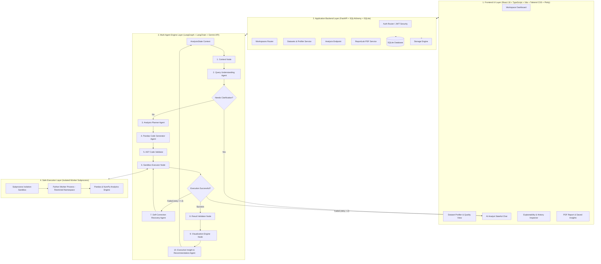

# Graph Analytics: Comprehensive Project & System Workflow Explanation

Welcome to **Graph Analytics**, a stateful multi-agent conversational data analysis platform. This document provides a complete technical explanation of the codebase, system architecture, multi-agent workflow, security sandbox execution, and end-to-end data lifecycle.

---

## 🏛️ 1. High-Level Architecture & System Diagram

Graph Analytics is structured cleanly into 4 decoupled layers:



---

## 🔄 2. Complete End-to-End Workflow

Here is the exact step-by-step sequence when a user interacts with Graph Analytics:

### Step 1: User Authentication & Workspace Creation
- **Action**: User registers/logs in via `POST /api/auth/register` or `POST /api/auth/login`.
- **Logic**: Password is hashed with `bcrypt` (or SHA-256 fallback). A JWT access token is signed using `HS256` and returned to the browser.
- **Workspace**: User creates a workspace (e.g. *"Q2 Retail Sales Analysis"*). A persistent workspace container is created in SQLite.

---

### Step 2: Dataset Upload, Validation & Profiling
- **Action**: User uploads a CSV file (e.g., `sample_retail_sales.csv`) via `POST /api/workspaces/{id}/datasets`.
- **Validation**:
  - Validates file type (`.csv`).
  - Checks file size and non-emptiness.
  - Storage service (`storage_service.py`) saves the CSV file to `backend/storage/datasets/{user_id}/{dataset_id}.csv`.
- **Automated Profiling (`profiling_service.py`)**:
  1. **Basic Info**: Calculates total row count, column count, memory footprint, file size.
  2. **Column Inspection**: Determines data type, unique values, null count, null %, sample values.
  3. **Numeric Statistics**: Calculates min, max, mean, median, standard deviation, and quartiles (25%, 50%, 75%).
  4. **Categorical Analysis**: Counts top categories and category frequencies.
  5. **Date Recognition**: Detects date/time columns, minimum date, maximum date, and date range in days.
  6. **Data Quality Score**: Calculates dataset health score (0–100%) based on missing values and duplicates, and generates automated data quality recommendations.
  7. **KPI Candidate Detection**: Uses column name heuristics and data value distributions to automatically identify business metrics (Revenue, Profit, Sales, Quantity, Orders, Margin).
  8. **Semantic Summary**: Builds a high-level dataset understanding object containing primary metrics, dimensions, time dimensions, and potential suggested analysis questions.

---

### Step 3: Initial Dashboard Generation
- **Logic (`dashboard_service.py`)**:
  - Immediately after profiling, the system generates:
    1. **KPI Cards**: Total Revenue, Total Profit, Order Count, Quantity.
    2. **Line Chart**: Time-series trend of primary metric aggregated monthly using Pandas `freq='ME'`.
    3. **Bar Chart**: Top categories by primary metric.
- **Result**: Displayed instantly on the **Overview** dashboard tab upon CSV upload!

---

### Step 4: Stateful Multi-Agent Conversational Analysis (`LangGraph`)
When the user types a natural language question (e.g., *"Which region generated the highest revenue?"*) in the **AI Analyst Chat** tab, `POST /api/workspaces/{id}/analysis` is invoked.

The request triggers the compiled **LangGraph Multi-Agent Workflow State Machine**:

#### Node 1: Context Loader (`nodes/context.py`)
- Formats dataset column definitions, statistical summaries, detected KPIs, and the last 6 messages from conversation history into readable text blocks for LLM reasoning.

#### Node 2: Query Understanding (`nodes/query_understanding.py`)
- Calls Gemini API (`gemini-2.0-flash`) using `QUERY_UNDERSTANDING_PROMPT`.
- Determines:
  - **Intent**: Aggregation, Grouping, Filtering, Ranking, Comparison, Trend, or Outlier.
  - **Target Metric**: Exact matched column name (e.g. `'Revenue'`).
  - **Group-By Dimensions**: Matched categorical column (e.g. `'Region'`).
  - **Ambiguity Detection**: Checks if query is underspecified or ambiguous.

#### Node 3: Clarification Check (`graph.py`)
- **If Ambiguous**: Workflow branches to `END`. Returns structured clarification prompt and option buttons to the user (e.g. *"Did you mean Gross Revenue or Net Revenue?"*).
- **If Clear**: Workflow proceeds to Node 4 (Planner).

#### Node 4: Analysis Planner (`nodes/planner.py`)
- Calls Gemini API using `PLANNER_PROMPT`.
- Generates a transparent, step-by-step logical plan (e.g., *1. Group records by Region, 2. Sum Revenue, 3. Sort descending, 4. Format output*).

#### Node 5: Pandas Code Generator (`nodes/code_generator.py`)
- Calls Gemini API using `CODE_GENERATOR_PROMPT`.
- Generates precise Pandas code targeting the pre-loaded DataFrame `df` and assigning the output to variable `result`.

#### Node 6: AST Code Validator (`execution/validator.py`)
- Statically parses the generated code string using Python's `ast.NodeVisitor`.
- Checks against forbidden modules (`os`, `sys`, `subprocess`, `socket`, `requests`, `shutil`, `open`, `eval`, `exec`).
- If security check fails, blocks execution immediately.

#### Node 7: Safe Subprocess Execution Sandbox (`execution/sandbox.py` + `execution/worker.py`)
- Writes code to a temporary script and spawns an isolated Python worker process (`worker.py`).
- Pre-loads dataset CSV safely into DataFrame `df`.
- Executes generated code in a restricted local scope with timeout enforcement (15s).
- Captures output DataFrame or scalar and serializes it as JSON.

#### Node 8: Error Recovery & Self-Correction (`nodes/recovery.py`)
- **If Execution Fails**: Captures exception traceback (e.g. KeyError or muddled column name).
- If `retry_count <= 2`, passes the error stack trace, failed code, and dataset schema back to Gemini API via `RECOVERY_PROMPT` to auto-correct the code.
- Loops back to Node 7 (Sandbox Executor) to re-test corrected code.

#### Node 9: Result Validator (`nodes/result_validator.py`)
- Validates DataFrame non-emptiness, NaN sanitization, scalar values, and summary stats.

#### Node 10: Visualization Engine (`nodes/visualization.py`)
- Automatically selects optimal visualization type based on result shape:
  - Date + Numeric $\rightarrow$ Interactive Line Chart.
  - Categorical + Numeric $\rightarrow$ Interactive Bar Chart.
  - 2 Numeric $\rightarrow$ Scatter Plot.
- Produces valid Plotly JSON specification (`data` & `layout`).

#### Node 11: Business Insights & Follow-up Suggestions (`nodes/insights.py`)
- Calls Gemini API using `INSIGHTS_PROMPT`.
- Synthesizes:
  1. **Executive Insight**: Factual, 2-4 sentence business summary derived strictly from executed data.
  2. **Actionable Recommendations**: 2-3 strategic recommendations.
  3. **Context-Aware Follow-Up Suggestions**: 3 next question chips (e.g. *"Only for 2025"*, *"Show monthly trend"*).

---

### Step 5: Conversation State Persistence & Multi-Turn Follow-Ups
- **State Persistence**: The question, intent, plan, AST code, raw table output, Plotly spec, business insights, recommendations, and follow-up chips are saved in SQLite (`analyses` and `analysis_results` tables).
- **Multi-Turn Continuity**: When user asks a follow-up question like *"Only for 2025"* or *"Compare that with 2024"*, the Query Understanding node inspects previous conversation history, merges active filters/metrics, and generates fresh safe Pandas analysis without starting over!

---

### Step 6: Analysis History & Explainability Inspector
- Users can click the **Analysis History** tab to view an audit trail of every past run.
- **Explainability Breakdown**:
  - Displays Query Intent JSON.
  - Displays step-by-step logical plan steps.
  - Displays AST-validated Python snippet.
  - Displays execution logs and raw results.

---

### Step 7: Saved Insights & Executive PDF Report Generation
- Users can click **Save Insight** on any AI response.
- In the **Reports & Insights** tab, users click **Generate PDF Report**.
- **ReportLab PDF Engine (`report_service.py`)**:
  - Compiles Title Header, Executive Summary, Dataset Profile & Quality Score table, Saved Insights list, Detailed Analyses table, and Methodology safety disclaimers into a downloadable PDF report!

---

## 🔒 3. Security Architecture & Execution Sandbox

Executing AI-generated code on a server is inherently risky if done carelessly. Graph Analytics implements **defense-in-depth isolation**:

| Security Layer | Implementation Mechanism |
| :--- | :--- |
| **AST Static Parsing** | `ast.NodeVisitor` inspects syntax tree before execution. Rejects forbidden AST imports (`os`, `sys`, `subprocess`, `socket`, `open`, `eval`, `exec`, `__import__`). |
| **Subprocess Process Boundary** | Code is NEVER executed inside the FastAPI main server process. It is executed in a spawned worker process (`worker.py`). |
| **Namespace Restriction** | Worker namespace only contains pre-loaded `df`, `pd`, `np`. Standard builtins (`open`, `eval`, `exec`, `input`) are removed. |
| **Execution Timeout** | `subprocess.run(timeout=15)` terminates infinite loops or heavy computations after 15 seconds. |

---

## 📁 4. Backend File Structure & Component Roles

| File Path | Role & Responsibility |
| :--- | :--- |
| [`backend/app/main.py`](file:///c:/Users/LENOVO/Desktop/Graph%20Analytics/backend/app/main.py) | FastAPI app entry point, CORS middleware, router registration, SQLite DB init. |
| [`backend/app/core/config.py`](file:///c:/Users/LENOVO/Desktop/Graph%20Analytics/backend/app/core/config.py) | Pydantic Settings, storage path definitions, Gemini API key loading. |
| [`backend/app/core/security.py`](file:///c:/Users/LENOVO/Desktop/Graph%20Analytics/backend/app/core/security.py) | Password hashing (`bcrypt`) & JWT token generation/validation. |
| [`backend/app/core/database.py`](file:///c:/Users/LENOVO/Desktop/Graph%20Analytics/backend/app/core/database.py) | SQLAlchemy SQLite engine & session dependency (`get_db`). |
| [`backend/app/models/`](file:///c:/Users/LENOVO/Desktop/Graph%20Analytics/backend/app/models/) | ORM models: `User`, `Workspace`, `Dataset`, `DatasetProfile`, `Conversation`, `Message`, `Analysis`, `AnalysisResult`, `SavedInsight`, `Report`. |
| [`backend/app/execution/validator.py`](file:///c:/Users/LENOVO/Desktop/Graph%20Analytics/backend/app/execution/validator.py) | AST-based code safety static analysis & forbidden call checker. |
| [`backend/app/execution/sandbox.py`](file:///c:/Users/LENOVO/Desktop/Graph%20Analytics/backend/app/execution/sandbox.py) | Subprocess worker process launcher with timeout enforcement. |
| [`backend/app/execution/worker.py`](file:///c:/Users/LENOVO/Desktop/Graph%20Analytics/backend/app/execution/worker.py) | Standalone script executed in isolated process to run Pandas snippet and format JSON output. |
| [`backend/app/services/profiling_service.py`](file:///c:/Users/LENOVO/Desktop/Graph%20Analytics/backend/app/services/profiling_service.py) | CSV profiling, quality score calculation, KPI detection & semantic summary. |
| [`backend/app/services/dashboard_service.py`](file:///c:/Users/LENOVO/Desktop/Graph%20Analytics/backend/app/services/dashboard_service.py) | Auto initial dashboard KPI cards & Plotly chart generation. |
| [`backend/app/services/report_service.py`](file:///c:/Users/LENOVO/Desktop/Graph%20Analytics/backend/app/services/report_service.py) | ReportLab PDF compilation engine. |
| [`backend/app/graph/state.py`](file:///c:/Users/LENOVO/Desktop/Graph%20Analytics/backend/app/graph/state.py) | LangGraph `AnalysisState` TypedDict definition. |
| [`backend/app/graph/graph.py`](file:///c:/Users/LENOVO/Desktop/Graph%20Analytics/backend/app/graph/graph.py) | LangGraph `StateGraph` state machine compilation & conditional branching. |

---

## 🎨 5. Frontend UI Structure & React Components

| Component File Path | UI Functionality |
| :--- | :--- |
| [`frontend/src/App.tsx`](file:///c:/Users/LENOVO/Desktop/Graph%20Analytics/frontend/src/App.tsx) | Auth session manager, active workspace routing. |
| [`frontend/src/pages/AuthPage.tsx`](file:///c:/Users/LENOVO/Desktop/Graph%20Analytics/frontend/src/pages/AuthPage.tsx) | Sleek dark-mode login & registration view. |
| [`frontend/src/pages/DashboardPage.tsx`](file:///c:/Users/LENOVO/Desktop/Graph%20Analytics/frontend/src/pages/DashboardPage.tsx) | Workspace selection cards & Create Workspace modal. |
| [`frontend/src/pages/WorkspacePage.tsx`](file:///c:/Users/LENOVO/Desktop/Graph%20Analytics/frontend/src/pages/WorkspacePage.tsx) | Main active workspace hub coordinating all 5 tabs. |
| [`frontend/src/components/layout/Navbar.tsx`](file:///c:/Users/LENOVO/Desktop/Graph%20Analytics/frontend/src/components/layout/Navbar.tsx) | Header, logo, workspace switcher dropdown, Gemini API Key modal. |
| [`frontend/src/components/layout/Sidebar.tsx`](file:///c:/Users/LENOVO/Desktop/Graph%20Analytics/frontend/src/components/layout/Sidebar.tsx) | Left navigation sidebar with tab buttons & badges. |
| [`frontend/src/components/dashboard/OverviewDashboard.tsx`](file:///c:/Users/LENOVO/Desktop/Graph%20Analytics/frontend/src/components/dashboard/OverviewDashboard.tsx) | Initial dashboard cards, time-series chart, bar chart, proactive question chips. |
| [`frontend/src/components/datasets/DatasetManager.tsx`](file:///c:/Users/LENOVO/Desktop/Graph%20Analytics/frontend/src/components/datasets/DatasetManager.tsx) | CSV upload trigger, quality score indicator, column profiling table, searchable dataset preview table. |
| [`frontend/src/components/chat/AIAnalystChat.tsx`](file:///c:/Users/LENOVO/Desktop/Graph%20Analytics/frontend/src/components/chat/AIAnalystChat.tsx) | Multi-turn chat interface, query intent tag, plan accordion, code inspection, Plotly chart, CSV download, AI insights, recommendations, follow-up chips, save insight action. |
| [`frontend/src/components/history/AnalysisHistory.tsx`](file:///c:/Users/LENOVO/Desktop/Graph%20Analytics/frontend/src/components/history/AnalysisHistory.tsx) | Timeline of past analyses with detailed explainability breakdown. |
| [`frontend/src/components/reports/ReportsManager.tsx`](file:///c:/Users/LENOVO/Desktop/Graph%20Analytics/frontend/src/components/reports/ReportsManager.tsx) | Saved insights list, PDF report creation form, downloadable PDF report archive. |
| [`frontend/src/components/common/Plot.tsx`](file:///c:/Users/LENOVO/Desktop/Graph%20Analytics/frontend/src/components/common/Plot.tsx) | Plotly React factory wrapper using `plotly.js-dist-min`. |

---

## 💾 6. Database Schema (SQLite)

The SQLite database (`graph_analytics.db`) contains 9 relational tables:

```
users (id, email, password_hash, name, created_at)
  │
  └── workspaces (id, user_id, name, description, created_at, updated_at)
        ├── datasets (id, workspace_id, filename, storage_path, row_count, column_count, created_at)
        │     └── dataset_profiles (id, dataset_id, profile_json, quality_score, created_at)
        ├── conversations (id, workspace_id, created_at, updated_at)
        │     └── messages (id, conversation_id, role, content, created_at)
        ├── analyses (id, workspace_id, dataset_id, conversation_id, question, intent_json, plan_json, generated_code, execution_status, error_message, created_at)
        │     └── analysis_results (id, analysis_id, result_json, chart_json, insights, created_at)
        ├── saved_insights (id, workspace_id, analysis_id, content, created_at)
        └── reports (id, workspace_id, name, file_path, created_at)
```

---

## 🎯 Summary of Key Differentiators

Unlike simple LLM wrappers that merely pass data in prompts, **Graph Analytics**:
1. Keeps raw data securely on the server (only sends schema/profiles to LLM).
2. Performs actual quantitative analysis using AST-validated Pandas Python logic in isolated subprocesses.
3. Automatically self-corrects code errors through a multi-turn LangGraph retry loop.
4. Maintains full stateful conversational context between follow-up questions.
5. Provides full explainability, audit trails, interactive Plotly charts, and downloadable PDF reports.
